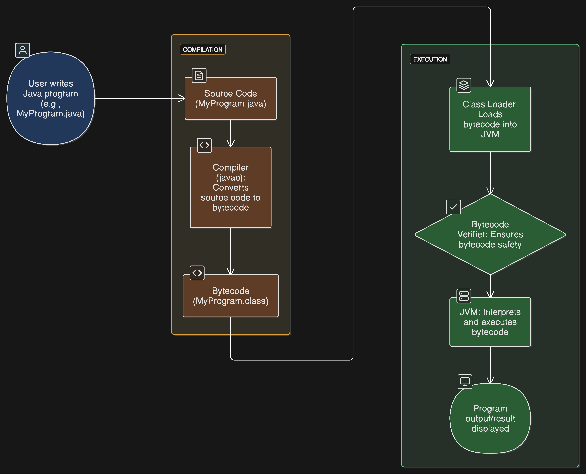

# **SECTION 1: JAVA: GETTING STARTED**

## **Table of Contents**

- [SECTION 1: JAVA: GETTING STARTED](#section-1-java-getting-started)
  - [LECTURE 1: Introduction to Java Programming](#lecture-1-introduction-to-java-programming)
  - [LECTURE 7: Hello World Java Program Without Maven](#lecture-7-hello-world-java-program-without-maven)
  - [How a Java Program Works](#how-a-java-program-works)
  - [LECTURE 11: Keywords and Variables in Java](#lecture-11-keywords-and-variables-in-java)

---

## **LECTURE 1: Introduction to Java Programming**

### Java Programming Language

Java is a high-level, class-based, object-oriented programming language designed to have as few implementation dependencies as possible. It follows the principle of "write once, run anywhere" (WORA), meaning that compiled Java code can run on all platforms that support Java without the need for recompilation.

### History

- **1991**: Initiated by James Gosling at Sun Microsystems, originally named "Oak".
- **1995**: Officially released as Java 1.0.
- **2010**: Oracle Corporation acquired Sun Microsystems, becoming the steward of Java.

### Key Features

- **Object-Oriented**: Emphasizes objects and classes, promoting modular and reusable code.
- **Platform Independence**: Java applications are compiled into bytecode, which can run on any device equipped with a Java Virtual Machine (JVM).
- **Automatic Memory Management**: Features garbage collection to handle memory allocation and deallocation.
- **Robust and Secure**: Designed to minimize errors and provide a secure execution environment.
- **Multithreaded**: Supports concurrent execution of multiple threads, enhancing performance for multi-core systems.

### Java Platform Components

- **Java Development Kit (JDK)**: A software development environment used for developing Java applications.
- **Java Runtime Environment (JRE)**: Provides libraries, Java Virtual Machine (JVM), and other components to run applications written in Java.
- **Java Virtual Machine (JVM)**: An engine that provides a runtime environment to execute Java bytecode.

---

## **LECTURE 7: HELLO WORLD JAVA PROGRAM WITHOUT MAVEN**

### Creating and Running a JAR File in IntelliJ IDEA

#### Steps to Create and Run a JAR File

1. **Create a Project and Class**

   - Create a project in IntelliJ IDEA.
   - Add a class, e.g., `Main.java`.
   - Write a simple program:

    ```java
    public class Main {
        public static void main(String[] args) {
            System.out.println("Hello, World!");
        }
    }
    ```  

2. **Configure JAR File**
    - Go to **File → Project Structure**.
    - Click on the **+ (Add)** sign and select **Artifacts → JAR → From modules with dependencies**.
    - Select the **Main class** and click **OK**.

3. **Package the JAR File**
    - Right-click on the `MANIFEST.MF` file.
    - Scroll down and select **Package File**.

4. **Locate the Output Folder**
    - Run the `Main.class` file once.
    - This generates the `out` folder, where you will find:
      - **artifacts** → `Udemy_JAVA_jar` → `Udemy_JAVA.jar`
      - **production** → `Udemy_JAVA`:
        - `Main.class`
        - `META-INF`:
          - `MANIFEST.MF`

5. **Run the JAR File**
    - Right-click the JAR file and select **Run "Udemy_JAVA.jar"**.
    - If you see this error:

    ```code
    
      Error: Could not find or load main class Main
      Caused by: java.lang.ClassNotFoundException: Main
    ```  

6. **Fix the Configuration**
    - Edit configurations:
    - Scroll to **Before Launch**.
      - Add **Build Artifacts** → Select the JAR file.

7. **Run the Program**

    - Execute the JAR file again. You should see:

      ```code
      Hello, World!
      ```  

💡 **Tips:**
    - Ensure your `MANIFEST.MF` file specifies the correct `Main-Class`.
    - Rebuild the artifact after every code change.  

---

## How a Java Program Works

This document outlines the process flow of how a Java program is compiled and executed, from writing the source code to displaying the output.

## 1. **User Writes Java Program**

The user writes a Java program in a text editor, typically saving it as a `.java` file.  
Example: `MyProgram.java`

**Action:** The user starts by writing Java code.

## 2. **Compilation Process (javac)**

- **Source Code:** The written Java program is saved as a `.java` file.
- **Compiler (javac):** The Java compiler (`javac`) takes the source code and converts it into bytecode, which is a platform-independent intermediate form of the program.
- **Bytecode:** After compilation, the output is saved as a `.class` file, containing the bytecode.

**Action:** The compiler converts the Java source code into bytecode.

## 3. **Execution Process (JVM)**

- **Class Loader:** The JVM loads the bytecode (`.class` file) into memory using the Class Loader. The Class Loader is responsible for finding and loading classes as needed.
- **Bytecode Verifier:** The bytecode is verified for safety and correctness by the Bytecode Verifier. This ensures that the bytecode adheres to Java’s security rules.
- **JVM:** The Java Virtual Machine interprets and executes the bytecode. It translates bytecode into machine code and executes it on the host machine.
- **Program Output:** Finally, the result of the program’s execution is displayed as output on the screen.

**Action:** The JVM interprets and executes the bytecode, producing the program output.

## **Flow Diagram of Java Program Execution**



---

## **LECTURE 11: KEYWORDS AND VARIABLES IN JAVA**

### **There are a total of 51 keywords in Java.**

Keywords are reserved words in Java that have a predefined meaning in the language. They cannot be used as identifiers (names for variables, classes, methods, etc.).

Keywords are fundamental to the Java programming language and are used to define the structure and behavior of Java programs. They are case-sensitive and must be written in lowercase.

### **Here is the list of keywords in Java:**

| Keyword       | Description                                                                 |
|---------------|-----------------------------------------------------------------------------|
| `abstract`    | Specifies that a class or method is abstract and must be implemented.       |
| `assert`      | Used for debugging purposes to test assumptions.                            |
| `boolean`     | Declares a variable with a true/false value.                                |
| `break`       | Terminates a loop or switch statement.                                      |
| `byte`        | Declares an 8-bit integer variable.                                         |
| `case`        | Defines a block of code in a switch statement.                              |
| `catch`       | Catches exceptions thrown by try block.                                     |
| `char`        | Declares a 16-bit Unicode character variable.                               |
| `class`       | Declares a class.                                                           |
| `const`       | Reserved but not used.                                                      |
| `continue`    | Skips the current iteration of a loop and moves to the next iteration.      |
| `default`     | Specifies the default block in a switch statement.                          |
| `do`          | Executes a block of code at least once before checking the condition.       |
| `double`      | Declares a double-precision floating-point variable.                        |
| `else`        | Specifies the block to execute if the `if` condition is false.              |
| `enum`        | Declares an enumerated type.                                                |
| `extends`     | Indicates that a class inherits from a superclass.                          |
| `final`       | Specifies that a variable, method, or class cannot be modified.             |
| `finally`     | Executes a block of code after `try-catch`, regardless of exception.        |
| `float`       | Declares a single-precision floating-point variable.                        |
| `for`         | Initiates a `for` loop.                                                     |
| `goto`        | Reserved but not used.                                                      |
| `if`          | Evaluates a condition and executes a block if true.                        |
| `implements`  | Specifies that a class implements an interface.                            |
| `import`      | Imports a package or class.                                                 |
| `instanceof`  | Tests whether an object is an instance of a class or subclass.              |
| `int`         | Declares a 32-bit integer variable.                                         |
| `interface`   | Declares an interface.                                                      |
| `long`        | Declares a 64-bit integer variable.                                         |
| `native`      | Specifies that a method is implemented in native (C/C++) code.             |
| `new`         | Creates new objects.                                                        |
| `null`        | Represents a null reference.                                                |
| `package`     | Declares a package.                                                         |
| `private`     | Specifies that a variable or method is accessible only within the class.    |
| `protected`   | Specifies that a variable or method is accessible within the package or subclass. |
| `public`      | Specifies that a variable or method is accessible from any class.           |
| `return`      | Returns a value from a method.                                              |
| `short`       | Declares a 16-bit integer variable.                                         |
| `static`      | Specifies that a variable or method belongs to the class.                   |
| `strictfp`    | Ensures floating-point calculations follow IEEE standards.                  |
| `super`       | Refers to the superclass of the object.                                     |
| `switch`      | Selects one of many code blocks to execute.                                 |
| `synchronized`| Ensures that only one thread can access a method/block at a time.           |
| `this`        | Refers to the current object instance.                                      |
| `throw`       | Throws an exception.                                                        |
| `throws`      | Declares exceptions that a method can throw.                                |
| `transient`   | Prevents serialization of a variable.                                       |
| `try`         | Initiates a block of code to test for exceptions.                           |
| `void`        | Specifies that a method does not return a value.                            |
| `volatile`    | Indicates that a variable can be modified by multiple threads.              |
| `while`       | Initiates a `while` loop that continues as long as the condition is true.   |
